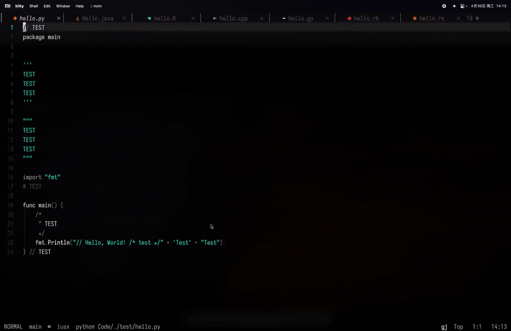

### nvim.command-hide

The plugin allows you to hide and show comments, and saves them to a specified folder.



#### Why install?

> [!NOTE]
> This is test version, if error and bug, click [issues](https://github.com/jiangxue-analysis/nvim.comment-hide/issues).

You are use [lazy.nvim](https://github.com/folke/lazy.nvim):

```lua

return {
  "jiangxue-analysis/nvim.comment-hide",
  name = "comment-hide",
  lazy = false,
  config = function()
    require("comment-hide").setup()
    vim.keymap.set("n", "<leader>vs", "<cmd>CommentHideSave<CR>", { desc = "Comment: Save (strip comments)" })
    vim.keymap.set("n", "<leader>vr", "<cmd>CommentHideRestore<CR>", { desc = "Comment: Restore from backup" })
  end,
}
```

If you not user [lazy.nvim](https://github.com/folke/lazy.nvim)? God be with you~

#### Why use?

1. **:CommentHideSave**: Create `.annotations/` storage code comments and **Delete the current file comment** move comments to `.annotations`.
2. **:CommentHideRestore**: Restore comments from `.annotations/` to the current file.

If you add the `.annotations/` directory to the `.gitignore` file, anyone without this directory will **be unable to restore your comments**.

#### Public comments

> 
>
> After executing `:CommentHideSave`, **please do not make any changes**, as this will disrupt the line numbers and prevent `:CommentHideRestore` from restoring the comments. 👊🐱🔥

```js
0 /* >>>                                                               
1   This will not be hidden and will be 2 visible to everyone          
2 */                                                                   
3                                                                      
4 const x = 42; // This is a comment                                   
5 /* This is a multi-line                                              
6    comment */                                                        
7 // Another comment                                                   
```

run `:CommentHideRestore`:

```js
1 /* >>>                                                           
2   This will not be hidden and will be 3 visible to everyone      
3 */                                                               
4                                                                  
5 const x = 42;                                                    
```

The `/* */` block remains because comment-hide allows preserving comments using `>>>`. Only block-style `/* */` comments support this feature.

These comments are stored in the `.annotations/` folder at the root directory. You can locate the JSON file by following the current file name.

```json
{"comments":[{"text":"\/\/ This is a comment"},{"text":"\/\/ Another comment"},{"multi":true,"text":"\/* This is a multi-line\n\/* This is a multi-line\n   comment *\/"}],"originalContent":"\/* >>>\n  This will not be hidden and will be visible to everyone\n*\/\n\nconst x = 42; \/\/ This is a comment\n\/* This is a multi-line\n   comment *\/\n\/\/ Another comment","filePath":"Code\/project\/iusx\/test\/hhha.js"}
```

To restore comments, run `:CommentHideRestore`, and the plugin will reinsert comments based on line numbers and positions:

```js
0 /* >>>                                                               
1   This will not be hidden and will be 2 visible to everyone          
2 */                                                                   
3                                                                      
4 const x = 42; // This is a comment                                   
5 /* This is a multi-line                                              
6    comment */                                                        
7 // Another comment                                                   
```

#### Next?

- [ ] : Restore all comments
- [ ] : Hide all file comments to the `.annotations/` directory
- [x] : Fix space placeholders after `:CommentHideSave`.
- [x] : Fix the absolute positioning issue.
- [x] : Customize hiding and showing, for example, comment blocks containing `>>>` will not be hidden

#### Support language

```js
java - lua - rlang - cpp - go - python - ruby - rust - javascript - html - scss - css - typescript - python - tsx -jsx - vue
---
maybe more?
```

#### Support test

```js
[RUST]
1 // COMMENT                        | 1 fn main() {                                                         
2 fn main() {                       | 2                                                                     
3     /*                            | 3     println!("// Hello, World!");                                   
4      * COMMENT                    | 4 }                                                                   
5      */                           | 5                                                                     
6     println!("// Hello, World!"); | 6 fn main() {                                                         
7 }                                 | 7                                                                     
8 // COMMENT                        | 8     println!("Hello, World! /* test */");                           
9                                   | 9 }                                                                   
10 fn main() {                                                                                              
11     /*                                                                                                   
12      * COMMENT                                                                                           
13      */                                                                                                  
14     println!("Hello, World! /* test */"); // TEST                                                        
15 }                                                                                                        

[JAVA]
1 // TEST                                                            | 1 public class Hello {                                              
2 public class Hello {                                               | 2     public static void main(String[] args) {                      
3     public static void main(String[] args) {                       | 3                                                                   
4         /* TEST */                                                 | 4         System.out.println("// Hello, World! /* TEST */");        
5         System.out.println("// Hello, World! /* TEST */"); // TEST | 5     }                                                             
7     }                                                              | 6 }                                                                 
8 }                                                                  |                                                                     

[R]
1 # TEST                          | 1 "Hello, World! # HEllo"                                           
2 "Hello, World! # HEllo"  # TEST | 2                                                                   

[CPP]
1 // TEST                                                              | 1 #include <iostream>                                                 
2 #include <iostream>                                                  | 2                                                                     
3                                                                      | 3 int main() {                                                        
4 int main() {                                                         | 4                                                                     
5     /*                                                               | 5     std::cout << "// Hello, World! /* test */" << std::endl;        
6      * TEST                                                          | 6     return 0;                                                       
7     */                                                               | 7 }                                                                   
8     std::cout << "// Hello, World! /* test */" << std::endl; // TEST |                                                                       
9     return 0;                                                        |                                                                       
10 }                                                                   |                                                                       

1 /**/ void /*function in the class*/ API /*that will*/ ::initCurl() {                           | 1  void  API  ::initCurl() {                            
2     /*the variable*/ handle /*is*/ = /*to the result of the function named*/ curl_easy_init(); | 2      handle  =  curl_easy_init();                     
3                                                                                                | 3                                                       
4     if /*the*/ (!handle) /*isn't*/ {                                                           | 4     if  (!handle)  {                                  
5         /*then*/ printf(/*the string:*/ "/*the content*/ curl couldnt init");                  | 5          printf( "/*the content*/ curl couldnt init");
6         /*and then*/ return /*nothing*/;                                                       | 6          return ;                                     
7     }                                                                                          | 7     }                                                 
8 }                                                                                              | 8 }                                                     

[GO]
1 package main                                 | 1 package main                                                        
2                                              | 2                                                                     
3 import "fmt"                                 | 3 import "fmt"                                                        
4                                              | 4                                                                     
5 func main() {                                | 5 func main() {                                                       
6   /*                                         | 6                                                                     
7    * TEST                                    | 7   fmt.Println("// Hello, World! /* test */")                        
8    */                                        | 8 }                                                                   
9   fmt.Println("// Hello, World! /* test */") |                                                                       
10 }                                           |                                                                       

[PYTHON]
1 // TEST         |      1 package main                                                        
2 package main    |      2                                                                     
3                 |      3 import "fmt"                                                        
4                 |      4                                                                     
5 '''             |      5 func main() {                                                       
6 TEST            |      6                                                                     
7 TEST            |      7     fmt.Println("// Hello, World! /* test */" + 'Test' + "Test")    
8 TEST            |      8 }                                                                   
9 '''                                                                                          
10                                                                                             
11 """                                                                                         
12 TEST                                                                                        
13 TEST                                                                                        
14 TEST                                                                                        
15 """                                                                                         
16                                                                                             
17 import "fmt"                                                                                
18 # TEST                                                                                      
19                                                                                             
20 func main() {                                                                               
21     /*                                                                                      
22      * TEST                                                                                 
23      */                                                                                     
24     fmt.Println("// Hello, World! /* test */" + 'Test' + "Test")                            
25 } // TEST                                                                                   

[RUBY]
1 puts '# Hello, World!' | 1 puts '# Hello, World!'                                              
2 # TEST                 |                                                                       

[JS]
1  // This is a single-line comment                                                                     
2  const commentRegex = /\/\/.*|\/\*[\s\S]*?\*\/|<!--[\s\S]*?-->|#.*$/gm;                               
3                                                                                                       
4  /* Multi-line                                                                                        
5     comment */                                 | 1  const commentRegex =                              
6                                                | /\/\/.*|\/\*[\s\S]*?\*\/|<!--[\s\S]*?-->|#.*$/gm;    
7  const test = "TEST";                          | 2                                                    
8                                                | 3  const test = "TEST";                              
9                                                | 4                                                    
10 // String with // inside                      | 5  /* >>>                                            
11 /* >>>                                        | 6      comment with // inside                        
12     comment with // inside                    | 7  */                                                
13 */                                            | 8  const str = "This is a // string";                
14 const str = "This is a // string";            | 9  const regex = /\/\*[\s\S]*?\*\/|\/\/.*$/gm;       
15 const regex = /\/\*[\s\S]*?\*\/|\/\/.*$/gm;                                                          
16                                                                                                      
17 // Regex with comment-like content                                                                   

[RUBY]
1 # TEST                                                                                                                 
2 puts "Hello, World!" # TEST                                                                                            
3                                                                                                                        
4 =begin                                                                                                                 
5 TEST                                                                                                                   
6 TEST                                                                                                                   
7 =end                                                                                                                   
8                                                                                                                        
9 puts '/* test */ This  # is a string with a # symbol that should not be treated as a comment.'                         
10                                                                                                                       
11 # TEST                                                                                                                
12 puts "# This should be printed literally"                                                                             
13 puts /# This looks like a comment but it's inside a regex/                                                            
14 puts '# Another case where the comment symbol is inside a string'                                                     
15                                                                                                                       
16 # TEST              | 1 puts "Hello, World!"                                                                          
17 =begin              | 2                                                                                               
18 TEST                | 3 puts '/* test */ This  # is a string with a # symbol that should not be treated as a comment.'
19 TEST                | 4                                                                                               
20 TEST                | 5 puts "# This should be printed literally"                                                     
21 TEST                | 6 puts /# This looks like a comment but it's inside a regex/                                    
22 =end                | 7 puts '# Another case where the comment symbol is inside a string'                             
23                     | 8                                                                                               
24 puts <<-DOC         | 9 puts <<-DOC                                                                                   
25 TEST                | 10 TEST                                                                                         
26 TEST                | 11 TEST                                                                                         
27 TEST                | 12 TEST                                                                                         
28 # TEST              | 13 # TEST                                                                                       
29 DOC                 | 14 DOC                                                                                          
30                     | 15                                                                                              
31 puts %q{TEST #TEST} | 16 puts %q{TEST #TEST}                                                                          
 
[HTML]
1  <!-- TEST -->                                                                      
2  <p>Hello, <!-- TEST --> World!</p>                                                 
3                                                                                     
4  <!--                                                                               
5  TEST                                                                               
6  TEST                                                                               
7  TEST                                                                               
8  -->                                                                                
9                                                                                     
10 <script>                                                                           
11 // TEST                                                                            
12 console.log("<!-- test -->Hello, World! // test /* test */"); /* TEST */           
13 </script>                                                                          
14                             | 1  <p>Hello,  World!</p>                             
15 <!-- TEST -->               | 2                                                    
16 <!--                        | 3  <script>                                          
17 >>>                         | 4                                                    
18 TEST                        | 5  console.log("<!-- test -->Hello, World! // test /*
19 -->                         | test */");                                           
20                             | 6  </script>                                         
21 <style>                     | 7                                                    
22 p {                                                                                
23   color: red; // This Color                                                        
24 }                                                                                  
25 </style>                                                                           

[LUA]
1  --[[ return { ]]                                                                                                                                                              
2  --[[   { ]]                                                                                                                                                                   
3  --[[     dir = "/Users/rhyme/Code/project/Jiangxue/nvim.comment-hide", ]]                                                                                                     
4  --[[     name = "comment-hide", ]]                                                                                                                                            
5  --[[     dev = true,]]                                    | 1  return {                                                                                                       
6  --[[     config = function() ]]                           | 2    "jiangxue-analysis/nvim.comment-hide",                                                                       
7  --[[       require("comment-hide").setup() ]]             | 3    name = "comment-hide",                                                                                       
8  --[[     end, ]]                                          | 4    lazy = false,                                                                                                
9  --[[   } ]]                                               | 5    config = function()                                                                                          
10 --[[ } ]]                                                 | 6      require("comment-hide").setup()                                                                            
                                                             | 7      vim.keymap.set("n", "<leader>vs", "<cmd>CommentHideSave<CR>", { desc = "Comment: Save (strip comments)" }) 
11 return {                                                  | 8      vim.keymap.set("n", "<leader>vr", "<cmd>CommentHideRestore<CR>", { desc = "Comment: Restore from backup" })
12   "jiangxue-analysis/nvim.comment-hide", -- This so good! | 9    end,                                                                                                         
13   name = "comment-hide",                                  | 10 }                                                                                                              
14   lazy = false,                                                                                                                                                               
15   config = function()                                                                                                                                                         
16     require("comment-hide").setup()                                                                                                                                           

[SCSS]
1  /* Set default margin and font for the body */                           
2  body {                            | 1  body {                            
3    margin: 0;                      | 2    margin: 0;                      
4    font-family: Arial, sans-serif; | 3    font-family: Arial, sans-serif; 
5    background-color: #f5f5f5;      | 4    background-color: #f5f5f5;      
6    h1 {                            | 5    h1 {                            
7      color: #333; // TEST          | 6      color: #333;                  
8      text-align: center;           | 7      text-align: center;           
9      margin-top: 40px;             | 8      margin-top: 40px;             
10   }                               | 9    }                               
11 }                                 | 10 }                                 

[TS]
1  // This is a single-line comment                                                          
2  const commentRegex = /\/\/.*|\/\*[\s\S]*?\*\/|<!--[\s\S]*?-->|#.*$/gm;                    
3                                                                                            
4  /* Multi-line   | 1 const commentRegex = /\/\/.*|\/\*[\s\S]*?\*\/|<!--[\s\S]*?-->|#.*$/gm;
5     comment */   | 2                                                                       
6                  | 3 const regex = /\/\*[\s\S]*?\*\/|\/\/.*$/gm;                           
7                                                                                            
8  // String with // insideconst str = "This is a // string";                                
9  const regex = /\/\*[\s\S]*?\*\/|\/\/.*$/gm; // Regex with comment-like content            

[TSX]
1  {            | 1 {                                                                      
2    // image   | 2                                                                        
3  }            | 3 }                                                                      
4  {                                                                                       
5    /* {isValidImageIcon                                                                  
6        ?  
7        : (icon && icon !== '') ? <em-emoji id={icon} /> : <em-emoji id='🤖' />            
8      } */                                                                                
9  }                                                                                       
```
